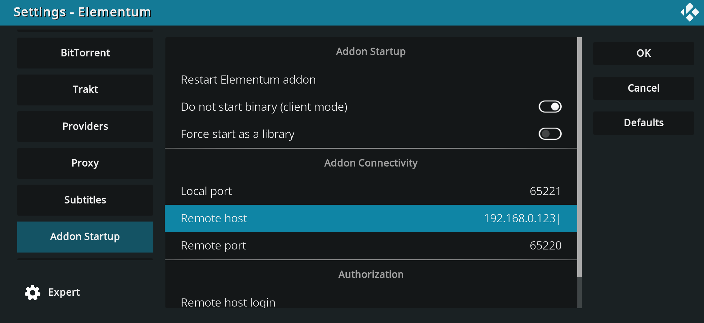

# Docker image and docker-compose service for Elementum

Since Elementum supports client-server mode, you can run Elementum in Docker either to offload processing from weak device or to use unsupported OS (like [Xbox](https://github.com/elgatito/plugin.video.elementum/issues/1117) or iOS or tvOS). You even can use normally incompatible OSes as client and server, e.g. Windows and Linux.

> [!TIP]
> You also can run Elementun as Linux daemon or Windows service (without docker) - take a look into how `elementum` binary is run in [Dockerfile](Dockerfile) and [docker-compose.yml](docker-compose.yml). If you will do that - then please share your configs (e.g. systemd unit) so we can add them to git repository.

The full conversation about client-server mode can be found [here](https://github.com/elgatito/plugin.video.elementum/issues/2).

## Usage

### Pre-requisites

1. Follow [the official guide](https://elementum.surge.sh/getting-started/installation/) and make sure you configured Kodi as described regarding remote control.

2. In Elementum settings in "Addon Startup" tab enable "client mode" and set "Remote host" to IP of your server with Docker.
    <details>
    <summary>Screenshot</summary>

    

    </details>

### Docker

1. Install [Docker Compose](https://docs.docker.com/compose/install/) and [git](https://git-scm.com/downloads). Clone this repository:

    ``` shell
    git clone https://github.com/ElementumOrg/elementum-docker.git
    cd elementum-docker
    ```

2. Copy [example.env](example.env) file to `.env` and set your values, you need to set at least `REMOTE_IP`, `ELEMENTUM_DOWNLOADS` and `ELEMENTUM_DATA`. File has comments about those variables.

3. Build and start the container

    ``` shell
    docker compose build
    docker compose up -d
    ```

(To get a new version of code: `git pull`.)

## Library usage

If you want to setup library - you can share server-side (server with Docker) `ELEMENTUM_DATA/elementum_library/` directory with Kodi (via SMB or NFS, for example) or you can share client-side (Kodi) directory with server, add `Movies` and `Shows` sub-directories to Kodi as sources (the same way like you do in a regular setup) and enable library sync in Elementum via `DISABLE_LIBRARY_SYNC=false`.

Kodi Library path in Docker and Client will be different - thus you should define substitutions for library path in format 'client_library_path|server_library_path' via `LIBRARY_SUBSTITUTION1`. You can use OS-specific paths (e.g. `C:\Kodi\Library|/home/ubuntu/elementum_data/elementum_library`, for example) in this substitution, Elementum will understand them.

> [!NOTE]
> This functionality was not thoroughly tested, so please create Issue or PR in plugin.video.elementum repo if you find issues.

## Supported OSes

This "docker compose" service was tested on **Linux** host as Docker server (using Docker Engine) and **Linux/Windows/Android** host as Kodi client.
You can use several clients with 1 server.

Looks like in Windows Docker Desktop "bridge" and "host" network drivers (in WSL and Hyper-V mode) work as NAT behind the scene, so Elementum can't identify Kodi's IP based on request IP since Elementum sees IP of NAT gateway but not real client IP (unlike with Linux Docker Engine). Also Elementum will use internal IP in replies to client and client will not be able to connect to that internal IP.
Thus, you must use special `-serverExternalIp=` parameter so Elementum will use this IP in replies and will not try to identify Kodi's IP based on client's IP (`-remoteHost=` value always will be used as Kodi's IP). You will not be able to use several clients with 1 server, obviously. If you have issues with "host" mode - then use "bridge" mode.
**Windows** host as server with Docker Desktop was tested with **Windows/Android** host as Kodi client.

[User tested](https://github.com/elgatito/plugin.video.elementum/issues/1117#issuecomment-2875906706) this "docker compose" service with **macOS** as server and **Xbox** as client. macOS behaves like Windows (same NAT issue), so you need to add `-serverExternalIp=` parameter. And container works only with "bridge" network driver.

## Troubleshooting

Run docker container manually:

`docker run -it --rm --entrypoint /bin/bash elementum:latest`

and then you can use `netcat` to check network connectivity:

`nc -vz 192.168.0.10 65221`

Log file can be found in `ELEMENTUM_DATA` directory.

Also, you can enter into already running container via `docker compose exec elementum bash`, in case if you want to see what's inside.
